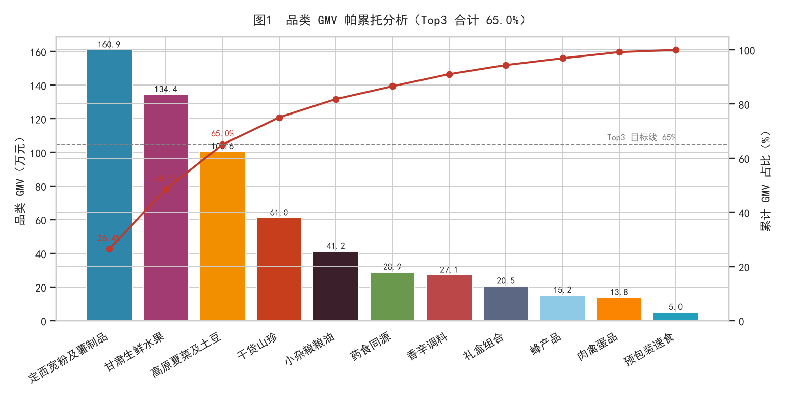
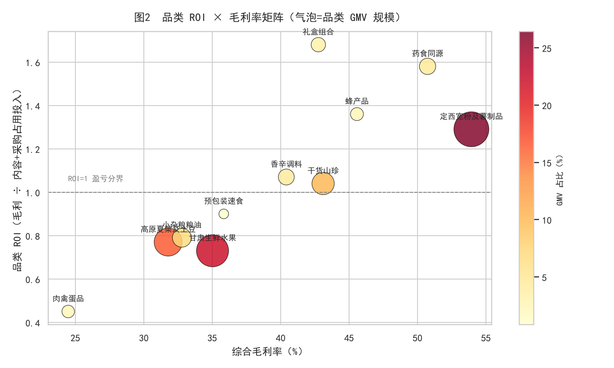
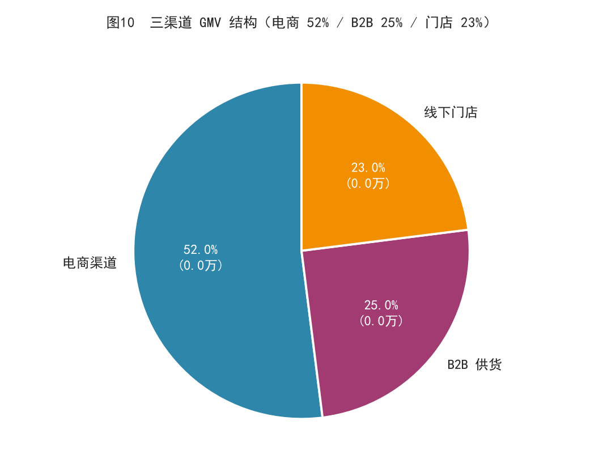
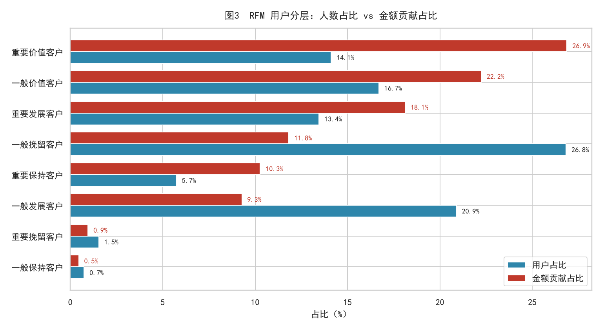
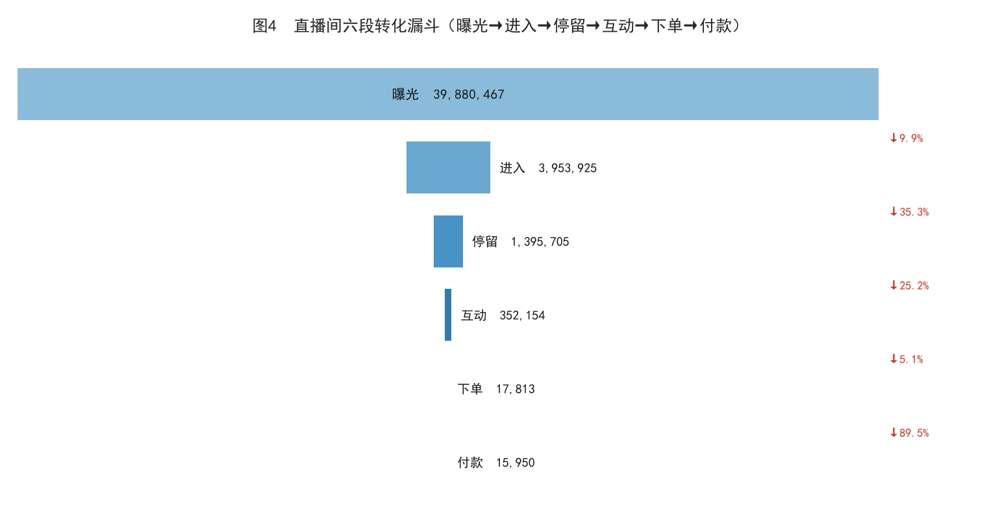
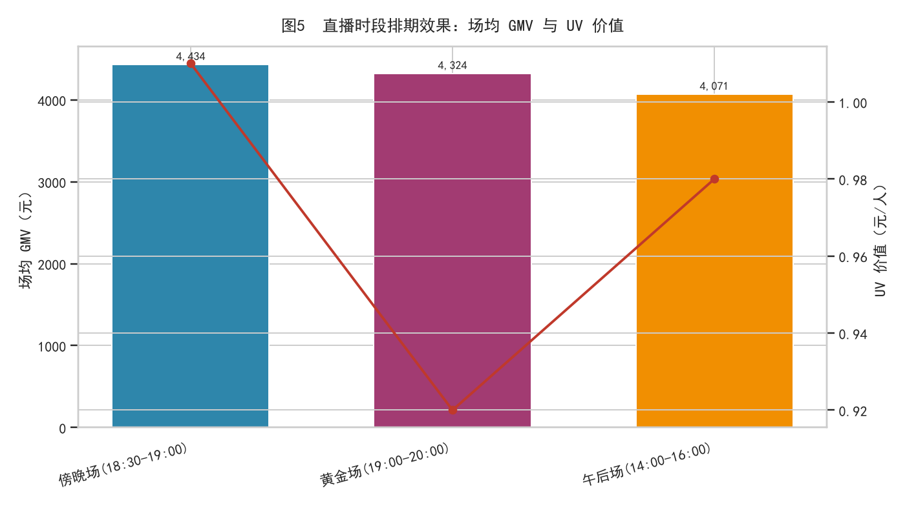
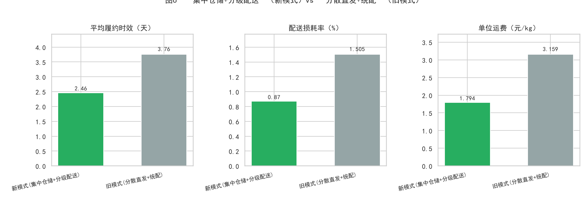
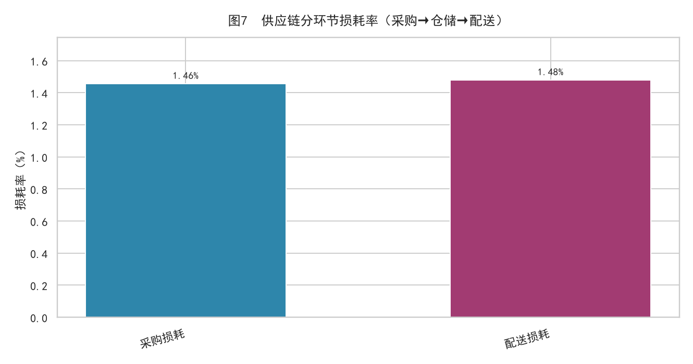
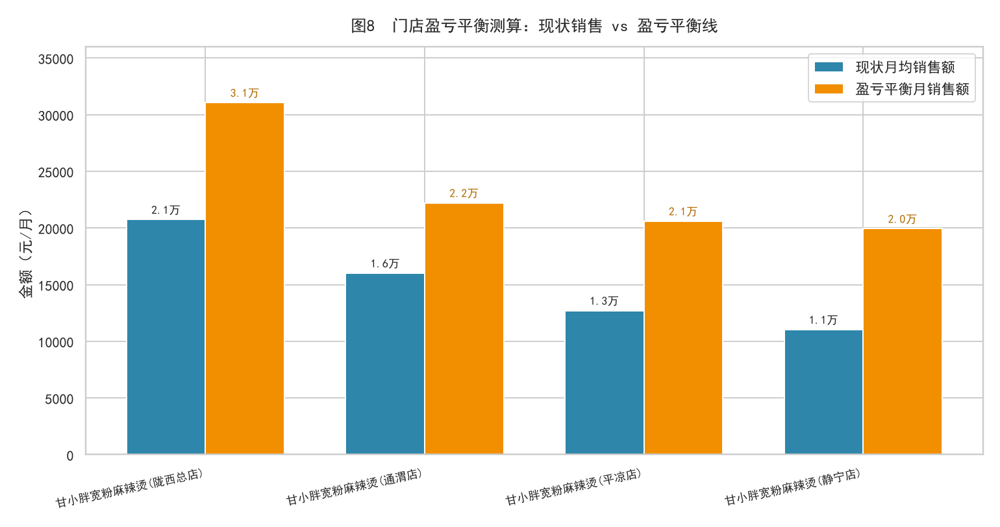
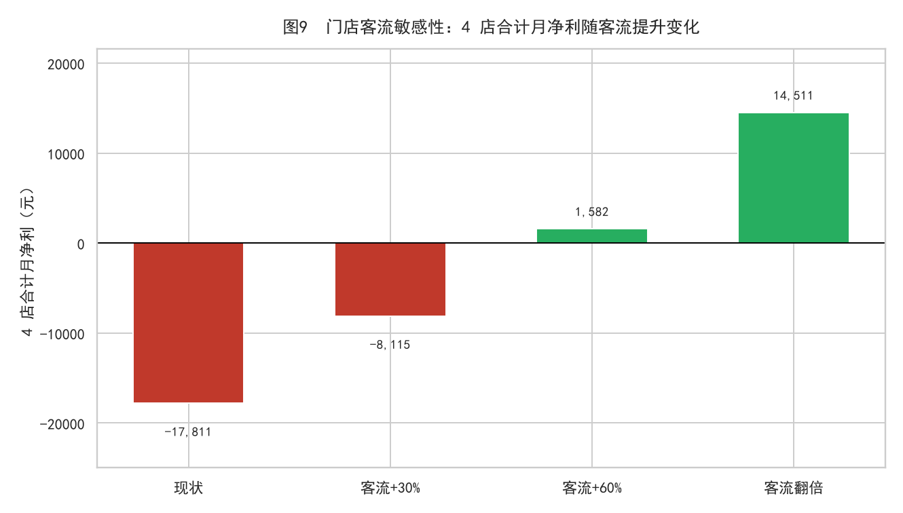

# “甘小胖”扎根富农产业链数据分析报告

> **⚠️ 数据声明：本报告全部数据由 Faker 按业务规则模拟生成（固定随机种子，可复现），仅用于数据分析方法复现与演示，不代表任何真实经营结果。**

- 分析区间：2025-01 ~ 2025-12（模拟）
- 数据规模：2,100 个 SKU、约 12 万条业务记录（电商订单/订单明细/B2B/门店日销/直播场次与分钟流量/采购/配送/库存）
- 技术栈：Python（Faker/pandas）+ MySQL 8（视图 + 窗口函数）+ matplotlib/seaborn + openpyxl
- 报告生成时间：2026-09-28 17:44:12 ｜ SQL ↔ Python 复算交叉校验：**通过 ✔**

---

## 一、项目背景

“甘小胖”是一个扎根甘肃县域的农产品产业链品牌（模拟设定），业务覆盖三条渠道：

1. **电商直播带货**（定西宽粉、生鲜水果等 11 大品类，抖音/快手式直播 + 短视频引流）；
2. **B2B 供货**（向商超、餐饮连锁、批发商供货）；
3. **线下门店**（4 家“甘小胖宽粉麻辣烫”县域门店）。

供应链正从「旧模式：分散直发 + 统配」向「新模式：集中仓储 + 分级配送」切换。本报告基于一套**四层指标体系**（明细层 → 汇总层 → 指标层 → 应用层），围绕五个业务问题展开：

| 模块 | 业务问题 | 方法 |
|---|---|---|
| A 品类 ROI | 货盘结构健康吗？内容投放值得吗？ | 全渠道 GMV 帕累托 + 毛利/内容投入 ROI |
| B 用户 RFM | 谁是高价值用户？复购怎么样？ | RFM 八分层 + 复购率 |
| C 直播漏斗 | 流量在哪一步流失？什么时段效率高？ | 六段转化漏斗 + 时段 × UV 价值 |
| D 供应链 | 新模式是否真的降本增效？ | 新旧模式时效/损耗/运费对比 + 分环节损耗 |
| E 门店盈利 | 县域门店模型跑得通吗？ | 单店 P&L + 盈亏平衡 + 客流情景测算 |

---

## 二、核心结论摘要

| 指标 | 数值 | 说明 |
|---|---|---|
| 全渠道 GMV | **¥608.63 万** | 电商 + B2B + 门店合计 |
| Top3 品类集中度 | **65.05%** | 定西宽粉及薯制品 / 甘肃生鲜水果 / 高原夏菜及土豆 |
| 电商复购率 | **22.14%** | 17,548 购买用户，人均 1.27 次 |
| 最高品类 ROI | **1.68（礼盒组合）** | 毛利 ÷ 内容投入 |
| 新模式履约时效 | **2.46 天** | 旧模式 3.76 天（电商订单口径） |
| 新模式配送损耗率 | **0.87%** | 旧模式 1.50% |
| 门店合计月净利 | **¥-17,811** | 4 家均未达盈亏平衡，缺口 ¥33,309/月 |
| 客流 +60% 情景净利 | **¥1,582/月** | 情景测算转正 |

**一句话总结**：货盘有明确支柱品类（宽粉），供应链新模式降本增效显著，但增长受限于「直播引流效率」和「门店客流不足」两大瓶颈；优先做直播进入率与门店引流，ROI 差的品类收缩投放。

---

## 三、品类结构与 ROI 分析



| 品类 | 在售SKU数 | 品类GMV | GMV占比_pct | 综合毛利率_pct | 内容投入成本 | 品类ROI |
|---|---|---|---|---|---|---|
| 定西宽粉及薯制品 | 404 | 1,609,228.91 | 26.44 | 53.93 | 673,222.55 | 1.29 |
| 甘肃生鲜水果 | 437 | 1,344,274.58 | 22.09 | 35.02 | 644,382.39 | 0.73 |
| 高原夏菜及土豆 | 286 | 1,005,683.98 | 16.52 | 31.78 | 413,070.23 | 0.77 |
| 干货山珍 | 174 | 610,386.13 | 10.03 | 43.10 | 251,936.71 | 1.04 |
| 小杂粮粮油 | 228 | 412,137.47 | 6.77 | 32.78 | 170,310.29 | 0.79 |
| 药食同源 | 124 | 288,601.79 | 4.74 | 50.73 | 92,884.39 | 1.58 |
| 香辛调料 | 108 | 271,188.06 | 4.46 | 40.41 | 102,246.81 | 1.07 |
| 礼盒组合 | 24 | 205,154.99 | 3.37 | 42.75 | 52,045.77 | 1.68 |
| 蜂产品 | 80 | 151,983.37 | 2.50 | 45.57 | 50,903.81 | 1.36 |
| 肉禽蛋品 | 68 | 138,137.31 | 2.27 | 24.48 | 74,997.57 | 0.45 |
| 预包装速食 | 44 | 49,517.83 | 0.81 | 35.84 | 19,667.64 | 0.90 |



**结论：**

1. **货盘高度集中**：**定西宽粉及薯制品（26.44%）**、**甘肃生鲜水果（22.09%）**、**高原夏菜及土豆（16.52%）**，合计占全渠道 GMV 的 **65.05%**。支柱品类定西宽粉及薯制品兼具规模（GMV 160.92 万）与利润（毛利率 53.93%），是现金流基本盘。
2. **ROI 分化明显**：ROI≥1 的品类 6 个（定西宽粉及薯制品、干货山珍、药食同源、香辛调料、礼盒组合、蜂产品）；ROI<1 的品类 5 个（甘肃生鲜水果、高原夏菜及土豆、小杂粮粮油、肉禽蛋品、预包装速食）。**礼盒组合 ROI 1.68 最高**，体量虽小（占比 3.37%）但适合节礼场景放大；**肉禽蛋品 ROI 仅 0.45**，毛利率 24.48% 叠加冷链成本高，投放需收缩。
3. **建议**：宽粉类稳投（高 GMV + ROI 1.29 为正）；生鲜水果/高原夏菜「高 GMV、ROI<1」，应优化投放素材与人群包而非追加预算；礼盒/药食同源/蜂产品作为利润补充重点培育。



---

## 四、用户 RFM 分层与复购分析



分层口径：R（最近购买天数）按中位数二分，F（购买频次）按 ≥2 次二分，M（累计金额）按中位数二分，共 8 层。

| 人群分层 | 用户数 | 人群占比_pct | 平均R天数 | 平均频次 | 平均金额 | 累计贡献金额 | 贡献占比_pct |
|---|---|---|---|---|---|---|---|
| 重要价值客户 | 2,476 | 14.11 | 107 | 2.30 | 343.76 | 851,147.90 | 26.87 |
| 一般价值客户 | 2,929 | 16.69 | 490 | 1.00 | 240.40 | 704,132.66 | 22.23 |
| 重要发展客户 | 2,361 | 13.45 | 125 | 1.00 | 243.07 | 573,887.48 | 18.12 |
| 一般挽留客户 | 4,707 | 26.82 | 481 | 1.00 | 79.56 | 374,465.92 | 11.82 |
| 重要保持客户 | 1,008 | 5.74 | 394 | 2.14 | 322.63 | 325,214.41 | 10.27 |
| 一般发展客户 | 3,666 | 20.89 | 122 | 1.00 | 80.17 | 293,907.23 | 9.28 |
| 重要挽留客户 | 271 | 1.54 | 102 | 2.00 | 111.29 | 30,158.46 | 0.95 |
| 一般保持客户 | 130 | 0.74 | 407 | 2.01 | 110.33 | 14,343.18 | 0.45 |

**结论：**

1. **复购是短板**：复购率 **22.14%**（人均 1.27 次），近 78% 用户只买一次——与生鲜/食品电商行业常态一致，说明「首单体验 → 二单转化」是最大杠杆。
2. **头部依赖明显**：「重要价值客户」以 14.11% 的人数贡献 **26.87%** 的电商金额（¥851,148），平均每人消费 ¥344、2.30 次。
3. **结构启示**：一般挽留 + 一般发展两类低频人群合计占比超 47% 但贡献仅约 21%；「重要价值客户」频次最高（2.30 次）。建议：对重要价值/保持客户推会员日与组合装锁复购；对 R 短 F 低的重要发展客户推二单券；对一般挽留客户做低成本短信召回。

---

## 五、直播转化漏斗与时段效果



| 环节 | 人次 | 环节转化率 | 占曝光比 |
|---|---|---|---|
| 曝光 | 39,880,467 | — | 100.00% |
| 进入 | 3,953,925 | 9.9% | 9.91% |
| 停留 | 1,395,705 | 35.3% | 3.50% |
| 互动 | 352,154 | 25.2% | 0.88% |
| 下单 | 17,813 | 5.1% | 0.04% |
| 付款 | 15,950 | 89.5% | 0.04% |

**漏斗解读（合计口径，全年直播场次汇总）：**

- **曝光 → 进入：9.9%** —— 最大流失点，受封面/标题/投流素材质量决定；
- **停留 → 互动：25.2%**，**互动 → 下单：5.1%** —— 第二流失点，货品讲解与价格锚点不足；
- **下单 → 付款：89.5%** —— 尾款流失相对健康。



| 时段 | 场次数 | 场均场观 | 场均付款人数 | 累计GMV | UV价值 |
|---|---|---|---|---|---|
| 黄金场(19:00-20:00) | 349 | 6,329 | 25.70 | 1,509,183.03 | 0.92 |
| 傍晚场(18:30-19:00) | 147 | 6,149 | 26.20 | 651,833.86 | 1.01 |
| 午后场(14:00-16:00) | 128 | 6,571 | 24.40 | 521,081.00 | 0.98 |

**结论：**

1. 「傍晚场(18:30-19:00)」**UV 价值最高（1.01 元）**，「黄金场(19:00-20:00)」**累计 GMV 最大（¥150.92 万）**——建议稳黄金场基本盘，把傍晚场作为增量时段加密排期。
2. 三个时段进入率均在 10% 左右，差异不大，说明**时段不是效率瓶颈，素材与货盘才是**；优化优先级：直播间封面/投流素材（提升进入率）＞ 讲解话术与限时机制（提升互动→下单）＞ 排期调整。

---

## 六、供应链：配送模式与损耗分析



| 配送模式 | 业务类型 | 单量 | 平均履约时效_天 | 配送损耗率_pct | 单位运费_元每kg | 累计运费 |
|---|---|---|---|---|---|---|
| 新模式(集中仓储+分级配送) | B2B供货 | 171 | 2.36 | 0.71 | 1.36 | 65,102.20 |
| 新模式(集中仓储+分级配送) | 电商订单 | 814 | 2.46 | 0.87 | 1.79 | 4,576.30 |
| 新模式(集中仓储+分级配送) | 门店补货 | 211 | 1.00 | 1.19 | 1.10 | 13,536.10 |
| 旧模式(分散直发+统配) | B2B供货 | 429 | 3.74 | 1.64 | 1.34 | 176,538.50 |
| 旧模式(分散直发+统配) | 电商订单 | 1,586 | 3.76 | 1.50 | 3.16 | 15,744.20 |
| 旧模式(分散直发+统配) | 门店补货 | 389 | 1.00 | 2.42 | 1.10 | 25,087.00 |



| 环节 | 损耗率_pct | 损耗量_kg |
|---|---|---|
| 采购损耗 | 1.46 | 1,684.60 |
| 配送损耗 | 1.48 | 3,286.30 |

**结论（以单量最大的电商订单口径）：**

1. **时效**：平均履约 **3.76 天 → 2.46 天**，缩短 1.3 天；B2B 供货同样 3.74 → 2.36 天。
2. **损耗**：配送损耗率 **1.50% → 0.87%**，下降 0.63 个百分点，对生鲜品类（毛利率仅 35%）意味着直接保住约 0.6pct 的毛利。
3. **成本**：单位运费 **3.16 → 1.79 元/kg**，下降 43.2%。
4. **分环节看**：采购损耗 1.46% 与配送损耗 1.48% 量级相当，集中采购质检 + 产地预冷是下一步压缩空间。

---

## 七、门店盈利测算与盈亏平衡分析

模型口径：月净利 = 月均毛利 −（月租金 + 人工 + 水电杂费 + 折旧摊销）；盈亏平衡月销售额 = 月固定成本 ÷ 综合毛利率；成本参数按县域真实水平设定（租金 1,500~2,200 元/月、人工 3,000~3,200 元/人/月、装修设备按 48 个月摊销）。



| 门店 | 面积㎡ | 月均销售额 | 综合毛利率_pct | 月固定成本合计 | 月净利 | 盈亏平衡月销售额 | 月销售缺口 | 盈亏平衡日均单量 | 实际日均单量 | 情景净利_客流加30pct | 情景净利_客流加60pct | 情景净利_客流翻倍 |
|---|---|---|---|---|---|---|---|---|---|---|---|---|
| 甘小胖宽粉麻辣烫(通渭店) | 38 | 16,007.98 | 53.70 | 11,925.00 | -3,328.71 | 22,206.70 | 6,198.72 | 27.40 | 19.80 | -749.83 | 1,829.06 | 5,267.57 |
| 甘小胖宽粉麻辣烫(平凉店) | 32 | 12,705.27 | 53.69 | 11,058.33 | -4,236.87 | 20,596.64 | 7,891.37 | 26.50 | 16.30 | -2,190.44 | -144.00 | 2,584.59 |
| 甘小胖宽粉麻辣烫(静宁店) | 30 | 11,028.53 | 53.69 | 10,700.00 | -4,778.78 | 19,929.22 | 8,900.69 | 26.90 | 14.90 | -3,002.42 | -1,226.05 | 1,142.44 |
| 甘小胖宽粉麻辣烫(陇西总店) | 45 | 20,730.87 | 52.98 | 16,450.00 | -5,466.79 | 31,049.45 | 10,318.58 | 37.10 | 24.70 | -2,171.82 | 1,123.14 | 5,516.43 |

**门店汇总**：现状月销售合计 ¥60,473，盈亏平衡要求 ¥93,782，**缺口 ¥33,309/月**；平均月净利 ¥-4,453。



**结论：**

1. **现状 4 家全部未达盈亏平衡**：最好的甘小胖宽粉麻辣烫(陇西总店)（月均销售 2.07 万）月净利仍为 ¥-5,467；压力最大的甘小胖宽粉麻辣烫(陇西总店)月亏 ¥5,467。
2. **缺口可量化**：各店盈亏平衡日均单量 26.5~37.1 单 vs 实际 14.9~24.7 单，**日均需多 8~13 单**，对应客流提升约 60% 时整体转正（合计净利 ¥1,582/月）；客流翻倍时合计净利可达 ¥14,511/月。
3. **经营建议**：门店定位应是「品牌体验 + 线上引流入口」而非短期利润中心——通过门店试吃扫码进直播间/社群，把门店客流转化为电商复购；在引流动作未验证前（跑通日均 +10 单），不建议新增门店。

---

## 八、综合结论与行动清单

| 优先级 | 行动 | 预期收益 | 依据 |
|---|---|---|---|
| P0 | 优化直播间封面/投流素材，进入率 9.9% → 15% | 场观 +50%，GMV 弹性最大 | 漏斗第一流失点 |
| P0 | 门店引流验证（试吃+扫码券），目标日均 +10 单 | 4 店合计月净利转正（约 +¥1,600/月，+60% 客流情景） | 盈亏平衡测算 |
| P1 | 二单券 + 会员日，复购率 22.1% → 30% | 电商 GMV +8%~10% | RFM：78% 用户单次购买 |
| P1 | 肉禽蛋品、生鲜水果收缩低效投放，预算转向礼盒/药食同源 | 内容 ROI 整体提升 | 品类 ROI 矩阵 |
| P2 | 扩大集中仓储覆盖线路，采购端产地预冷 | 损耗再降 0.3~0.5pct | 新旧模式对比 + 分环节损耗 |

---

## 附录

### A. 指标体系（四层）

- **明细层**：订单/明细/B2B/门店日销/直播场次/分钟流量/采购/配送/库存 9 张事实表 + 5 张维度表；
- **汇总层**：品类 × 渠道、用户 RFM、直播场次、配送单、门店月度等汇总视图（`sql/01_metric_views.sql`）；
- **指标层**：GMV/毛利率/ROI/复购率/转化率/履约时效/损耗率/坪效/人效/盈亏平衡等 40+ 指标；
- **应用层**：5 个分析 SQL（`sql/a_~e_*.sql`）+ Python 复算 + 10 张图 + Excel 看板 + 本报告。

### B. SQL ↔ Python 一致性校验

同一指标分别用 MySQL（视图+窗口函数）与 pandas 独立复算，容差 1e-4（相对）：

1. 电商 GMV（摊销口径）✔
2. 电商复购率 ✔
3. 全渠道 GMV ✔
4. 门店合计月净利 ✔

结果：`cross_check_passed = true`

### C. 复现方式

```bash
python -m venv venv && venv/Scripts/activate
pip install -r requirements.txt
python scripts/01_generate_data.py     # 生成模拟数据（固定 seed）
python scripts/02_clean_data.py        # 清洗
python scripts/03_load_to_mysql.py     # 建库入库（需先配置 config/db_config.py）
python scripts/05_run_queries.py       # 5 个分析 SQL + pandas 复算校验
python scripts/06_make_figures.py      # 10 张图
python scripts/07_make_dashboard.py    # Excel 看板
python scripts/08_make_report.py       # 本报告
```

### D. 转 Word

```bash
pandoc reports/甘小胖经营数据分析报告.md -o reports/甘小胖经营数据分析报告.docx --resource-path=reports
```

---

> **再次声明：本报告全部数据为模拟数据，仅用于方法复现，不代表真实经营结果。**
